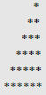
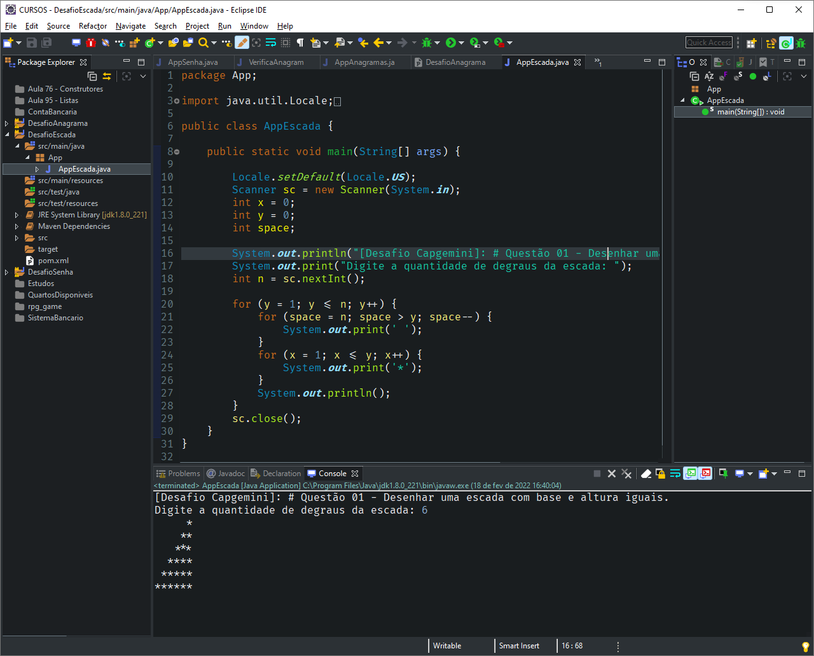

# DESAFIO DE PROGRAMAÇÃO - ACADEMIA CAPGEMINI

## # Questão 01

[PT](README.md) | [EN](README-en.md)

<!-- TOC -->

- [DESAFIO DE PROGRAMAÇÃO - ACADEMIA CAPGEMINI](#desafio-de-programa%C3%A7%C3%A3o---academia-capgemini)
    - [# Questão 01](#-quest%C3%A3o-01)
    - [Informações gerais](#informa%C3%A7%C3%B5es-gerais)
    - [Tecnologias utilizadas](#tecnologias-utilizadas)
    - [Configurações](#configura%C3%A7%C3%B5es)
    - [Como usar](#como-usar)
    - [Capturas de tela](#capturas-de-tela)
    - [Sobre mim](#sobre-mim)

<!-- /TOC -->

## Informações gerais

**Desafio proposto:**

> Escreva um algoritmo que mostre na tela uma escada de tamanho n utilizando o caractere * e espaços. A base e altura da escada devem ser iguais ao valor de n. A última linha não deve conter nenhum espaço.

**Exemplo:**
> n = 6

**Saída:**

## Tecnologias utilizadas

- Java JDK: version 1.8.0_221
- Eclipse IDE: version 2019-03 (4.11.0)

## Configurações

Este projeto pode ser clonado/importado para sua IDE favorita e como este é um projeto Maven, todas as dependências serão tratadas por ele.

## Como usar

1. Abra o arquivo `AppEscada.java` no pacote `App` em `scr\main\java`.

2. Após abrir o arquivo, poderá rodar o programa, de acordo com a sua IDE. Para o Eclipse, poderá clicar com o botão direito no código fonte, procurar a opção `Run As > Java Application`, ou simplesmente clicar no botão `Run` na barra de ferramentas.

3. Seguir os passos indicados no console.

## Capturas de tela

Como usar

## Sobre mim

<!-- TOC ignore:true -->
### Olá! 👋

Me chamo Gustavo Siqueira, também conhecido como Guga. Estou aqui para compatilhar códigos com o mundo!

- 🌱 Atualmente estudo front-end 🌎 Web Development: HTML | CSS | JavaScript.
- 🦾 Atualmente estudo back-end: ☕ Java | 🐍 Python.
- 🐞 Atualmente estudo QA: Testes automáticos com JUnit | Selenium | Cucumber | Appium
- 📫 Pode me contatar através do e-mail: guss.ns@gmail.com

  <a href="https://github.com/siqueira-gustavo">
  
  

 
  
  
  
  
  
  
  
  
  
  
  
  

<!-- TOC ignore:true -->
##

  
  

  <!--  -->

