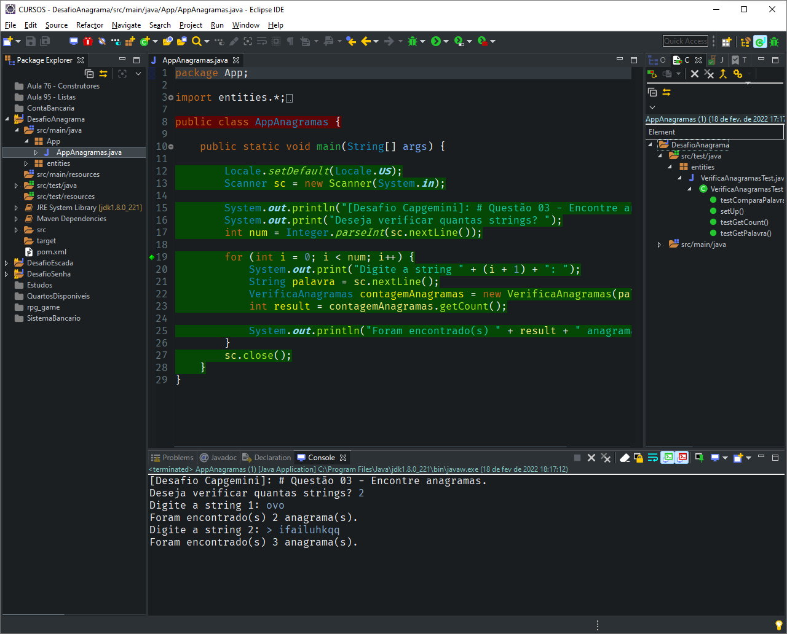
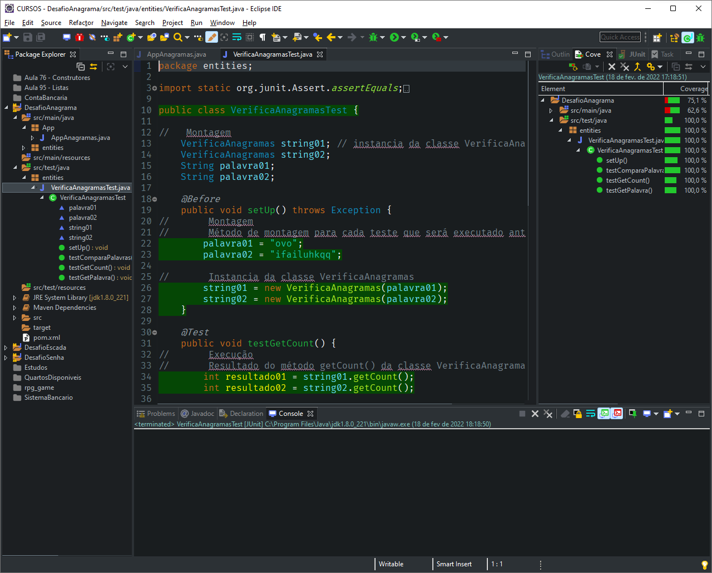

# PROGRAMMING CHALLENGE - CAPGEMINI ACADEMY

## # Question 02

[PT](README.md) | [EN](README-en.md)

<!-- TOC -->

- [PROGRAMMING CHALLENGE - CAPGEMINI ACADEMY](#programming-challenge---capgemini-academy)
    - [# Question 02](#-question-02)
    - [General Information](#general-information)
    - [Technologies Used](#technologies-used)
    - [Setup](#setup)
    - [Usage](#usage)
    - [Unitary tests](#unitary-tests)
    - [Screenshot](#screenshot)
    - [About me](#about-me)

<!-- /TOC -->

## General Information

**Challenge:**

> Two words can be considered anagrams of themselves if the letters in one word can be reassigned to form the other word. Given any string, develop an algorithm that finds the number of pairs of substrings that are anagrams.

**Example 1:**
> ovo

**Output:**
> 2

**Clarification:**
> The list of all even anagrams are: [o, o], [ov, vo] which are in positions [ [0], [2] ], [ [0, 1], [1, 2] ] respectively.

**Example 2:**
> ifailuhkqq

**Output:**
> 3

**Clarification:**
> The list of all even anagrams are: [i, i], [q, q] and [ifa, fai] which are in positions [ [0], [3] ], [ [8],  [9] ] and [ [0, 1, 2], [1, 2, 3] ].

## Technologies Used

- Java JDK: version 1.8.0_221
- Eclipse IDE: version 2019-03 (4.11.0)
- JUnit: version 4.12

## Setup

This project can be cloned/import to your favorite IDE and since this is a Maven project, all dependencies will be handled by it.

## Usage

1. Open the `AppAnagramas.java` file in the `App` package in `scr\main\java`.

2. After opening the file, you can run the program, according to your IDE. For Eclipse, you can right click on the source code, look for the `Run As > Java Application` option, or simply click the `Run` button on the toolbar.

3. Follow the steps indicated on the console.

## Unitary tests

To perform the unit tests created for the methods of this application, simply:

1. Open the `VerificaAnagramasTest.java` file in the `entities` package in `scr\test\java`.

2. After opening the file, you can run the program, according to your IDE. For Eclipse, you can right click on the source code, look for the `Run As > JUnit Test` option.

3. If you want to check the test coverage, you can right click on the source code, look for the `Coverage As > JUnit Test` option.

## Screenshot

Usage

Unitary tests

## About me

<!-- TOC ignore:true -->
### Hi there 👋

I'm Gustavo Siqueira, a.k.a Guga. I'm here to share code with the world!

- 🌱 I’m currently learning front-end 🌎 Web Development: HTML | CSS | JavaScript.
- 🦾 I’m currently learning back-end: ☕ Java | 🐍 Python.
- 🐞 I’m currently learning QA: automation with JUnit | Selenium | Cucumber | Appium
- 📫 How to reach me: guss.ns@gmail.com

  <a href="https://github.com/siqueira-gustavo">
  
  

 
  
  
  
  
  
  
  
  
  
  
  
  

<!-- TOC ignore:true -->
##  

  
  

  <!--  -->

