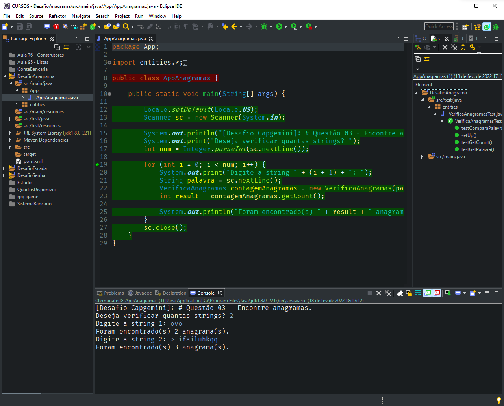
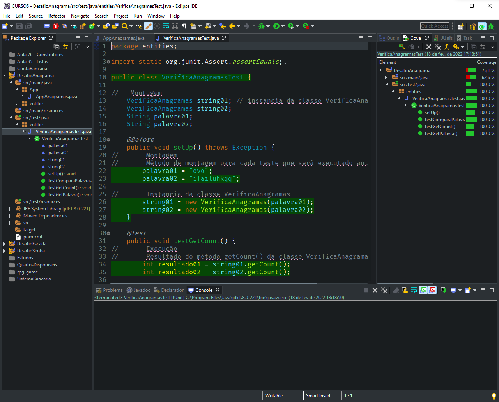

# DESAFIO DE PROGRAMAÇÃO - ACADEMIA CAPGEMINI

## # Questão 03

[PT](README.md) | [EN](README-en.md)

<!-- TOC -->

- [DESAFIO DE PROGRAMAÇÃO - ACADEMIA CAPGEMINI](#desafio-de-programa%C3%A7%C3%A3o---academia-capgemini)
    - [# Questão 03](#-quest%C3%A3o-03)
    - [Informações gerais](#informa%C3%A7%C3%B5es-gerais)
    - [Tecnologias utilizadas](#tecnologias-utilizadas)
    - [Configurações](#configura%C3%A7%C3%B5es)
    - [Como usar](#como-usar)
    - [Testes unitários](#testes-unit%C3%A1rios)
    - [Capturas de tela](#capturas-de-tela)
    - [Sobre mim](#sobre-mim)

<!-- /TOC -->

## Informações gerais

**Desafio proposto:**

> Duas palavras podem ser consideradas anagramas de si mesmas se as letras de uma palavra podem ser realocadas para formar a outra palavra. Dada uma string qualquer, desenvolva um algoritmo que encontre o número de pares de substrings que são anagramas.

**Exemplo 1:**
> ovo

**Saída:**
> 2

**Explicação:**
> A lista de todos os anagramas pares são: [o, o], [ov, vo] que estão nas posições [ [0], [2] ], [ [0, 1], [1, 2] ] respectivamente.

**Exemplo 2:**
> ifailuhkqq

**Saída:**
> 3

**Explicação:**
> A lista de todos os anagramas pares são: [i, i], [q, q] e [ifa, fai] que estão nas posições [ [0], [3] ], [ [8],  [9] ] e [ [0, 1, 2], [1, 2, 3] ].

## Tecnologias utilizadas

- Java JDK: version 1.8.0_221
- Eclipse IDE: version 2019-03 (4.11.0)
- JUnit: version 4.12

## Configurações

Este projeto pode ser clonado/importado para sua IDE favorita e como este é um projeto Maven, todas as dependências serão tratadas por ele.

## Como usar

1. Abra o arquivo `AppAnagrama.java` no pacote `App` em `scr\main\java`.

2. Após abrir o arquivo, poderá rodar o programa, de acordo com a sua IDE. Para o Eclipse, poderá clicar com o botão direito no código fonte, procurar a opção `Run As > Java Application`, ou simplesmente clicar no botão `Run` na barra de ferramentas.

3. Seguir os passos indicados no console.

## Testes unitários

Para realizar os testes unitários criados para os métodos dessa aplicação basta:

1. Abra o arquivo `VerificaAnagramasTest.java` no pacote `entities` em `scr\test\java`.

2. Após abrir o arquivo, poderá rodar o programa, de acordo com a sua IDE. Para o Eclipse, poderá clicar com o botão direito no código fonte, procurar a opção `Run As > JUnit Test`.

3. Caso deseje verificar a cobertura do teste, poderá clicar com o botão direito no código fonte, procurar a opção `Coverage As > JUnit Test`.

## Capturas de tela

Como usar

Testes unitários

## Sobre mim

<!-- TOC ignore:true -->
### Olá! 👋

Me chamo Gustavo Siqueira, também conhecido como Guga. Estou aqui para compatilhar códigos com o mundo!

- 🌱 Atualmente estudo front-end 🌎 Web Development: HTML | CSS | JavaScript.
- 🦾 Atualmente estudo back-end: ☕ Java | 🐍 Python.
- 🐞 Atualmente estudo QA: Testes automáticos com JUnit | Selenium | Cucumber | Appium
- 📫 Pode me contatar através do e-mail: guss.ns@gmail.com

  <a href="https://github.com/siqueira-gustavo">
  
  

 
  
  
  
  
  
  
  
  
  
  
  
  

<!-- TOC ignore:true -->
##

  
  

  <!--  -->

