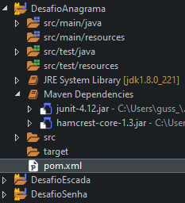

# PROGRAMMING CHALLENGE - CAPGEMINI ACADEMY

[PT](README.md) | [EN](README-en.md)

<!-- TOC -->

- [PROGRAMMING CHALLENGE - CAPGEMINI ACADEMY](#programming-challenge---capgemini-academy)
    - [General Information](#general-information)
    - [Technologies Used](#technologies-used)
    - [Screenshots](#screenshots)
    - [Setup](#setup)
    - [About me](#about-me)

<!-- /TOC -->

## General Information
These are my answers of Capgemini Academy Programming Challenge.

 
The results can be accessed through the folders in this repository, or through the links below.

- [# Question 01](./CapgeminiQuestao01/)
- [# Question 02](./CapgeminiQuestao02/)
- [# Question 03](./CapgeminiQuestao03/)

## Technologies Used
- Java JDK: version 1.8.0_221
- Eclipse IDE: version 2019-03 (4.11.0)
- JUnit: version 4.12

## Screenshots

## Setup
This project can be cloned/import to your favorite IDE and since this is a Maven project, all dependencies will be handled by it.

## About me

<!-- TOC ignore:true -->
### Hi there 👋

I'm Gustavo Siqueira, a.k.a Guga. I'm here to share code with the world!

- 🌱 I’m currently learning front-end 🌎 Web Development: HTML | CSS | JavaScript.
- 🦾 I’m currently learning back-end: ☕ Java | 🐍 Python.
- 🐞 I’m currently learning QA: automation with JUnit | Selenium | Cucumber | Appium
- 📫 How to reach me: guss.ns@gmail.com

  <a href="https://github.com/siqueira-gustavo">
  
  

 
  
  
  
  
  
  
  
  
  
  
  
  

<!-- TOC ignore:true -->
##  
 

 
  
   

  <!--  -->
 

